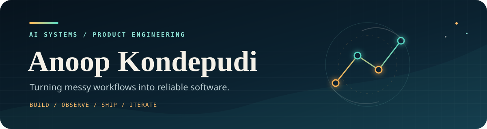
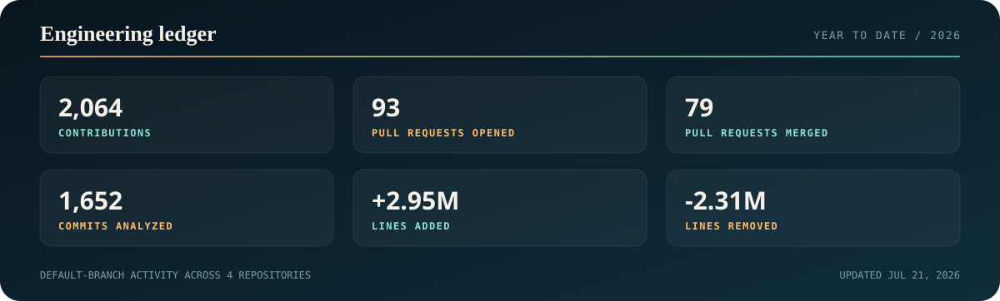

  

 

I build software at the intersection of **AI, automation, and product engineering**. I like systems that take an ambiguous real-world workflow, make it observable, and carry it all the way to a reliable product.

### What I work on

- **Agentic workflows** that turn conversations and intent into issues, plans, code, and pull requests.
- **Production automation** that stays useful when APIs fail, data is messy, and the happy path ends.
- **Data-rich products** with clear dashboards, maps, and operational tooling.

`TypeScript` / `Next.js` / `React` / `Python` / `PostgreSQL` / `GitHub Actions`

## Selected builds

<table>
  <tr>
    <td width="50%" valign="top">
      <h3><a href="https://github.com/Anoop-Kondepudi/meet2code">Meet2Code</a></h3>
      
A fully agentic meeting-to-PR pipeline: live transcription becomes structured tasks, GitHub issues, implementation plans, generated code, and pull requests.

      
<code>Next.js 16</code> <code>Python</code> <code>OpenAI</code> <code>GitHub</code>

    </td>
    <td width="50%" valign="top">
      <h3><a href="https://github.com/Anoop-Kondepudi/OpenStreet">OpenStreet</a></h3>
      
A community-first civic platform designed to give residents and city governments one transparent place to understand and act on local data.

      
<code>Next.js 15</code> <code>TypeScript</code> <code>Mapbox</code>

    </td>
  </tr>
  <tr>
    <td width="50%" valign="top">
      <h3><a href="https://github.com/Anoop-Kondepudi/Education-Webscraper-V2">Education Webscraper V2</a></h3>
      
A modernized, more efficient generation of an education-data extraction system, rebuilt to reduce resource usage and improve maintainability.

      
<code>Web automation</code> <code>Data extraction</code> <code>APIs</code>

    </td>
    <td width="50%" valign="top">
      <h3><a href="https://github.com/Anoop-Kondepudi/continue-dev-nextjs">Continue.dev Rebuild</a></h3>
      
A clean, editable Next.js reconstruction of a static marketing site with typed components, modern animation, and no Webflow lock-in.

      
<code>Next.js 15</code> <code>TypeScript</code> <code>GSAP</code>

    </td>
  </tr>
</table>

## 2026 engineering ledger

  

  Counts include private activity totals available to the tracker. Private repository names, code, and commit details are never written to this public repository.

## How I approach the work

I care about the unglamorous parts that make software dependable: bounded retries, useful failure states, reproducible tests, explicit security boundaries, and documentation that still helps after the context has faded.

  <a href="https://github.com/Anoop-Kondepudi?tab=repositories">Explore the repositories</a>
  &nbsp;&middot;&nbsp;
  <a href="https://github.com/Anoop-Kondepudi?tab=stars">See what I am learning from</a>

<!--
The metrics card is refreshed by .github/workflows/metrics.yml when the
PROFILE_METRICS_TOKEN repository secret is configured.
-->
